# ⚡ Languages, Tools & Technologies

 

<table width="100%">
<tr>

<td width="25%" align="center">

### 🎨 Development

 

</td>

<td width="25%" align="center">

### 🖥 Languages

 

</td>

<td width="25%" align="center">

### 🗄 Database

 

</td>

<td width="25%" align="center">

### 🛠 Tools

 

</td>

</tr>
</table>

---

---

## 🌐 Connect with me!

 

<table width="60%">
<tr>

<td width="50%" align="center">

<a href="YOUR_LINKEDIN" target="_blank">

 

</a>

</td>

<td width="50%" align="center">

<a href="YOUR_TWITTER" target="_blank">

 

</a>

</td>

</tr>
</table>

 

